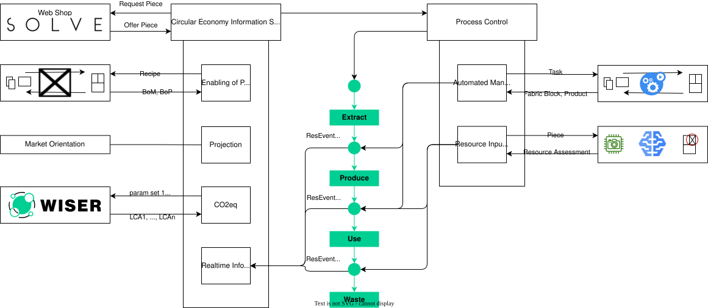

# clab-prototype

The Circular Economy (CE) is an economic principle that relies on
[closed-loop](https://www.ellenmacarthurfoundation.org/the-circular-economy-in-detail-deep-dive)
instead of open loop models with the goal to enable a more sustainable and
[competitive economy](https://eur-lex.europa.eu/eli/reg/2024/1781/oj). In the shadow of finding new
business models and opportunities in a circular economy, a new challenge for information processing
arises. The key to the data that unlocks the full potential of CE does not solely lie in the hands
of producers anymore, but it is held by participants along the whole value chain, including
consumers. Therefore, the data is highly heterogeneous and fragmented. The Circular Economy
Information Systems (CEIS) is our research platform to exploring the future of CE and to finding
solutions to these challenges through hands-on digital innovation. Current CEIS demonstrators
integrate CO2 footprint assessments and end-of-life scenario calculations across regional repair
networks, enabling stakeholders to compare environmental impacts of repair, recirculation, and new
production — bridging fragmented value-chain data into actionable circular decisions.

## Architecture

The overall idea is presented by the following diagram:




## How to run

All components can be run from the workspace root using `uv`:

### backend

```bash
uv run --directory clab_ceis/ceis_backend python main.py
```

### dashboard

```bash
uv run --directory clab_ceis/ceis_dashboard python main.py
```

### shop

```bash
uv run --directory clab_ceis/ceis_shop main.py
```

Then connect to `http://localhost:8050` (shop), `http://localhost:8051` (dashboard), and `http://localhost:8053` (admin)

### admin

```bash
uv run --directory clab_ceis/ceis_admin python main.py
```

Connect to `http://localhost:8053` to reach the admin API.

| Endpoint | Method | Description |
|---|---|---|
| `/` | GET | **Web UI** – status dashboard with restart buttons |
| `/ui` | GET | **Web UI alias** (same dashboard) |
| `/status` | GET | Health status of all three apps (JSON) |
| `/status/{app_name}` | GET | Health status of a single app (JSON) |
| `/restart` | POST | Restart all apps |
| `/restart/{app_name}` | POST | Restart a single app |

Valid `app_name` values: `ceis_backend`, `ceis_shop`, `ceis_dashboard`.

### Running with the Devcontainer

The `.devcontainer/post-create.sh` script installs dependencies for all components on container creation. In GitHub Codespaces it also prepares the admin UI hyperlinks to use Codespaces port-forwarding URLs instead of `localhost`. If the environment variable `CLAB_CEIS_RUN` is set, it also starts the backend, dashboard, and shop in the background automatically.

When the admin tool starts or restarts CEIS services, it writes their output to `/tmp/ceis_backend.log`, `/tmp/ceis_dashboard.log`, and `/tmp/ceis_shop.log`. The admin service itself logs to `/tmp/ceis_admin.log`.

## How to run tests

### backend

```bash
uv run --directory clab_ceis/ceis_backend pytest
```

To run tests with verbose output:

```bash
uv run --directory clab_ceis/ceis_backend pytest -v
```
